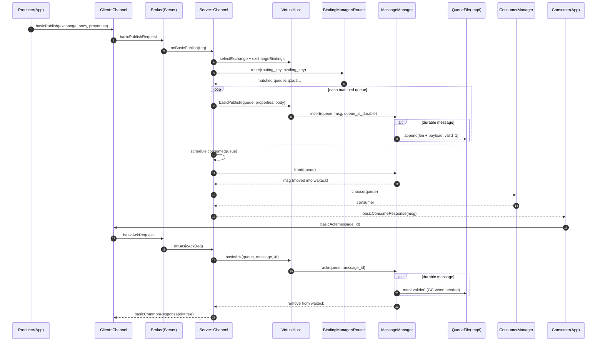

# Day 1 - Publish to ACK Sequence

```mermaid
sequenceDiagram
    autonumber
    participant P as Producer(App)
    participant CC as Client::Channel
    participant B as Broker(Server)
    participant SC as Server::Channel
    participant VH as VirtualHost
    participant BM as BindingManager/Router
    participant MM as MessageManager
    participant QF as QueueFile(.mqd)
    participant CM as ConsumerManager
    participant C as Consumer(App)

    P->>CC: basicPublish(exchange, body, properties)
    CC->>B: basicPublishRequest
    B->>SC: onBasicPublish(req)

    SC->>VH: selectExchange + exchangeBindings
    SC->>BM: route(routing_key, binding_key)
    BM-->>SC: matched queues q1/q2...

    loop each matched queue
        SC->>VH: basicPublish(queue, properties, body)
        VH->>MM: insert(queue, msg, queue_is_durable)
        alt durable message
            MM->>QF: append(len + payload, valid=1)
        end
    end

    SC->>SC: schedule consume(queue)
    SC->>MM: front(queue)
    MM-->>SC: msg (moved into waitack)
    SC->>CM: choose(queue)
    CM-->>SC: consumer
    SC-->>C: basicConsumeResponse(msg)

    C->>CC: basicAck(message_id)
    CC->>B: basicAckRequest
    B->>SC: onBasicAck(req)
    SC->>VH: basicAck(queue, message_id)
    VH->>MM: ack(queue, message_id)
    alt durable message
        MM->>QF: mark valid=0 (GC when needed)
    end
    MM-->>SC: remove from waitack
    SC-->>CC: basicCommonResponse(ok=true)
```
